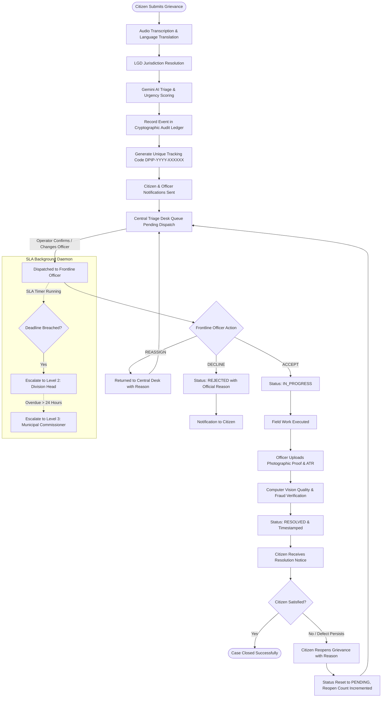
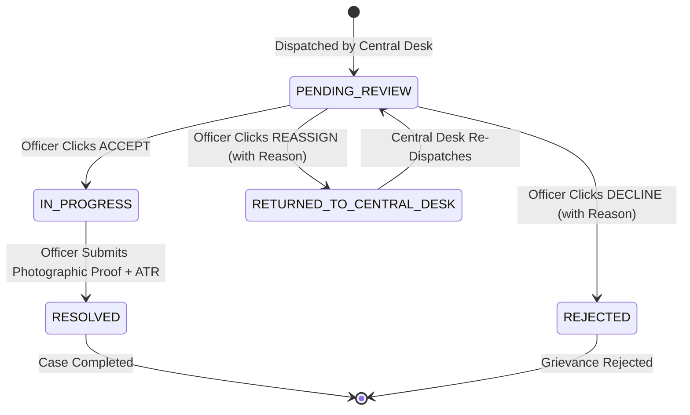
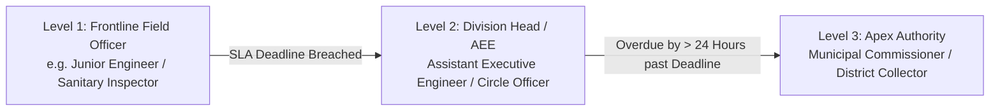

# National Digital Public Infrastructure (DPIP) — Citizen Grievance & Civic Infrastructure Management System

## Executive Overview & Architectural Summary

The **National Digital Public Infrastructure (DPIP) Platform** is an enterprise-grade, AI-driven civic redressal and municipal infrastructure intelligence system. It seamlessly bridges citizens, municipal call centers (Central Triage Desk), frontline field engineers, division heads, and municipal commissioners.

The platform combines:
1. **Multimodal Citizen Ingestion:** Voice notes in vernacular Indian languages (with automated Speech-to-Text and translation), photographic/document uploads, GPS coordinate capture with reverse geocoding, and Local Governance Directory (LGD) jurisdiction routing.
2. **AI-Powered Triage & Routing:** Google Gemini multimodal analysis for real-time urgency scoring (1–100), categorization across 9 government departments, and candidate frontline officer recommendations.
3. **Human-in-the-Loop Central Triage Desk:** Dispatcher interface to review AI recommendations, inspect live field workloads, reassign, or confirm dispatch.
4. **Frontline Officer Resolution Suite:** Role-Based Access Control (RBAC) mobile & web portal featuring an Action Workflow (Accept, Reassign back to Central Desk, Decline with reason, or Resolve with mandatory photographic proof and Action Taken Reports).
5. **Computer Vision Anti-Fraud Verification:** Automated inspection of before-and-after photographic evidence to detect fake, stock, or incomplete repairs.
6. **Statutory SLA & Hierarchical Escalation Engine:** Department-specific SLA countdown timers with automated escalation from Level 1 (Field Officer) $\rightarrow$ Level 2 (Division Head) $\rightarrow$ Level 3 (Municipal Commissioner).
7. **Citizen Reopening & Post-Resolution Audit:** Ability for citizens to reopen unresolved grievances with automated re-routing to Central Desk.
8. **Cryptographically Chained Audit Ledger:** Immutable, SHA-256 chained ledger recording all actions, timestamps, actors, and payloads.
9. **Predictive GIS Spatial Clustering & CapEx Engine:** Spatial aggregation of localized civic issues into chronic infrastructure hotspots, synthesizing municipal Capital Expenditure (CapEx) plans and budget estimations.

---

## Complete Step-by-Step Workflow: Citizen Submission to Closure & Beyond

---

### Phase 1: Grievance Ingestion & Multimodal Capture
1. **Citizen Access:** Citizen accesses the web portal (`/complaints/register`) or mobile app.
2. **Data Capture:**
   - **Text Description:** Citizen types problem description (or leaves blank if using voice).
   - **Voice Note Recording:** Citizen records an audio clip in any supported language (Hindi, English, Tamil, Telugu, Kannada, Bengali, Marathi, etc.) using the in-browser MediaRecorder.
   - **Visual Evidence:** Citizen attaches photos or documents (JPEG, PNG, WebP, PDF, MP4 up to 15MB).
   - **Geographic Location:** Interactive OpenStreetMap/Leaflet picker captures exact latitude, longitude, street address, and postal code.
3. **Multilingual Processing (`VoicePipelineService`):**
   - Transcribes audio into original text.
   - Identifies spoken language code.
   - Translates transcript into standardized English and appends to complaint record.
4. **LGD Jurisdiction Resolution:**
   - Extracts pin code from address (or defaults to administrative zone code, e.g. `LGD-DEL-042`).

---

### Phase 2: AI Triage & Dynamic Severity Scoring
1. **Gemini AI Engine (`analyze_and_assign_complaint_with_gemini`):**
   - **Severity Scoring (1.0 to 100.0):** Evaluates hazard level, public safety risk, affected population density, and infrastructure disruption.
   - **Urgency Tier:** Categorized into `CRITICAL` ($\ge 85$), `HIGH` ($\ge 65$), `MEDIUM` ($\ge 40$), or `LOW` ($< 40$).
   - **Department Categorization:** Mapped to one of the 9 official statutory departments:
     - Public Works Department (PWD / Roads)
     - Electricity & Power Distribution
     - Water Supply & Sewerage Board
     - Sanitation & Solid Waste Management
     - Public Health & Medical Services
     - Town & Country Planning
     - Law & Order (Police)
     - School Education Department
     - Revenue & Land Administration
   - **Officer Candidate Matching:** Evaluates active on-duty officers within that department and jurisdiction and selects the most relevant candidate (`gemini_suggested_officer`).
   - **AI Analysis Summary:** Generates a justification detailing why the urgency score and officer were selected.
2. **Identifier Generation & Database Persistence:**
   - Unique Tracking Code generated: `DPIP-YYYY-XXXXXX` (e.g., `DPIP-2026-X7K9M2`).
   - Initial status set to `PENDING`.
   - `central_desk_reviewed` set to `False`.
3. **Cryptographic Audit Ledger Event:**
   - Event `complaint.created` recorded with SHA-256 previous hash link, timestamp, payload hash, and unique UUID.
4. **Automated Citizen Notification:**
   - Confirmation email/SMS sent to citizen with tracking code, assigned category, and real-time tracking URL (`/complaints/track/{tracking_code}`).

---

### Phase 3: Human-in-the-Loop Central Triage Desk Dispatch
1. **Central Desk Inbox (`/central-desk`):**
   - Central Desk operators see real-time queues prioritized by `ai_severity_score` descending.
   - Queue tabs: *New Triage Queue*, *Reassigned by Officers*, *Active Dispatches*, *Resolved Grievances*, *Declined Tickets*.
2. **Review & Dispatch Action:**
   - Operator inspects citizen media, AI analysis summary, suggested department, and suggested officer.
   - Operator views live on-duty officer roster with current active ticket counts.
   - Operator confirms the Gemini suggested officer or selects an alternative officer, adds optional *Dispatch Notes*, and triggers dispatch.
3. **State Transition:**
   - `assigned_officer` is updated.
   - `central_desk_reviewed` becomes `True`.
   - `central_desk_operator` is linked.
   - Audit event `central_desk.dispatched` is chained into the ledger.
   - Email alert sent to the assigned frontline officer.

---

### Phase 4: Frontline Officer Field Operations & 3-Action Workflow
The assigned officer logs in at `/officer` and accesses their prioritized inbox (strictly ordered by AI severity score). For each assigned ticket, the officer has three primary action paths:

1. **Action Path A — ACCEPT:**
   - Officer accepts field responsibility.
   - Status updates from `PENDING` $\rightarrow$ `IN_PROGRESS`.
   - Audit event `complaint.accepted` recorded.
   - Citizen notified that work has commenced on-site.
2. **Action Path B — REASSIGN:**
   - If the issue falls outside the officer's jurisdiction, ward, or technical scope, the officer provides a mandatory explanation.
   - Ticket is stripped of `assigned_officer`, `reassigned_to_central_desk` becomes `True`, and ticket routes back to the Central Desk's *Reassigned Queue*.
   - Audit event `complaint.reassigned_central_desk` recorded.
3. **Action Path C — DECLINE:**
   - If the complaint is unverifiable on-site, a duplicate, or malicious, the officer provides a detailed rejection reason.
   - Status transitions to `REJECTED`.
   - Audit event `complaint.declined` recorded.
   - Citizen notified with the official reason.

---

### Phase 5: Resolution & Computer Vision Anti-Fraud Quality Audit
1. **Mandatory Resolution Requirements:**
   - To mark a ticket `RESOLVED`, the officer must submit:
     1. **Photographic Resolution Proof (`resolution_proof`):** Mandatory image file ($< 15\text{MB}$) proving completion.
     2. **Action Taken Report (ATR):** Textual summary detailing physical repairs, replacement parts, or remedial measures.
   - Backend strictly rejects any resolution request lacking photographic proof with HTTP 400 Bad Request.
2. **Automated Computer Vision Inspection (`ComputerVisionQualityService`):**
   - Analyzes resolution photo against original complaint context and description.
   - Assigns a `vision_confidence_score` (0.0 to 1.0).
   - Sets `vision_verification_status`:
     - `VERIFIED`: Clear evidence of repair / resolved defect.
     - `FLAGGED`: Suspected unresolved, blank, stock photo, or mismatch.
     - `INCONCLUSIVE`: Ambiguous lighting/angle requiring manual audit.
3. **Timestamping & State Finalization:**
   - `resolved_at` set to current timestamp.
   - Status becomes `RESOLVED`.
   - Audit event `complaint.resolved` recorded.
   - Citizen receives completion notification with ATR and resolution proof.

---

### Phase 6: Citizen Grievance Reopening Lifecycle
If a citizen is dissatisfied with the resolution, finds that the defect was only temporarily patched, or believes the ticket was wrongfully declined:

1. **Citizen Reopen Action (`/complaints/track/{tracking_code}`):**
   - Reopen button is accessible for any complaint with status `RESOLVED` or `REJECTED`.
   - Citizen provides a mandatory explanation ($ \ge 5$ characters).
   - Authentication check: If complaint was submitted by a registered citizen account, the user must be authenticated as that citizen. If submitted anonymously, contact verification (phone/email) is validated.
2. **State & Queue Reset:**
   - Status resets to `PENDING`.
   - `is_reopened` is set to `True`.
   - `reopen_count` is incremented by 1.
   - `reopened_at` is timestamped.
   - `previous_resolved_at` preserves prior resolution time for audit history.
   - `reassigned_to_central_desk` is set to `True` and `central_desk_reviewed` set to `False`.
3. **Priority Re-Triage:**
   - The reopened ticket immediately appears in the Central Desk queue with a highlighted `REOPENED (Count: N)` badge for priority supervisor intervention.
   - Audit event `complaint.reopened` recorded.
   - Citizen receives immediate confirmation of grievance reactivation.

---

## Statutory SLAs & Hierarchical Escalation Matrix

### 1. Department-Specific Statutory SLA Durations

| Department Category | Statutory Resolution Target | Initial Assigned Level |
| :--- | :--- | :--- |
| **Law & Order / Immediate Safety Hazard** | **12 Hours** | Level 1: Field Officer / SHO |
| **Electricity & Power Distribution** | **24 Hours** | Level 1: Junior Engineer (JE) |
| **Sanitation & Solid Waste Management** | **24 Hours** | Level 1: Sanitary Inspector |
| **Water Supply & Sewerage Board** | **48 Hours** | Level 1: Junior Engineer / AE |
| **Public Works Department (PWD / Roads)** | **72 Hours** | Level 1: Junior Engineer (Civil) |
| **Town & Country Planning / Encroachments** | **96 Hours** | Level 1: Assistant Town Planner |
| **General / Other Departments** | **48 Hours** | Level 1: Designated Ward Officer |

---

### 2. SLA Status Calculation Engine

- $\text{Hours Remaining} = \frac{\text{SLA Deadline} - \text{Current Time}}{3600\text{ seconds}}$
- **Status States:**
  - `COMPLIANT`: Active ticket with $> 12$ hours remaining before deadline.
  - `APPROACHING_BREACH`: Active ticket with $\le 12$ hours remaining.
  - `BREACHED`: Active ticket where current time exceeds `sla_deadline`.
  - `RESOLVED_IN_SLA`: Resolved prior to `sla_deadline`.
  - `RESOLVED_OVERDUE`: Resolved after `sla_deadline` elapsed.

---

### 3. Multi-Tier Hierarchical Escalation Protocol

The background daemon (`check_slas` Celery task / management command) runs continuously:

1. **Level 1 (Field Officer):** Default tier upon initial Central Desk dispatch.
2. **Level 2 (Division Head / Assistant Executive Engineer):** Triggered automatically when `timezone.now() > sla_deadline`. `is_escalated` set to `True`, `escalation_level` set to `LEVEL_2_DIVISION`, and audit event `complaint.sla_breached_escalated` generated.
3. **Level 3 (Municipal Commissioner / District Collector):** Triggered when an active ticket remains unresolved $> 24$ hours past its statutory deadline while at Level 2. `escalation_level` elevated to `LEVEL_3_COMMISSIONER`, notifying apex executive oversight.

---

## Cryptographic Tamper-Evident Audit Ledger

Every sensitive mutation across the lifecycle is appended to an immutable, cryptographically hashed ledger table (`AuditEvent`):

$$\text{Event Hash} = \text{SHA256}(\text{PrevHash} + \text{EventID} + \text{Actor} + \text{Timestamp} + \text{Action} + \text{Resource} + \text{PayloadHash})$$

- **Genesis Block:** `0000000000000000000000000000000000000000000000000000000000000000`
- **Immutability Protection:** Django model `save()` and `delete()` overrides raise `PermissionError` if an existing record is edited or deleted.
- **Verification API (`/api/audit/verify/`):** Traverses sequence from #1 to latest block, recomputing SHA-256 hashes and validating that no record was altered, injected, or removed.

---

## Predictive GIS Spatial Clustering & CapEx Recommendations

1. **Haversine Distance Clustering (`GISClusteringService`):**
   - Continuously groups geographically adjacent complaints within a calibrated radius ($\sim 150\text{m}$).
   - Identifies chronic structural deterioration corridors (e.g., repeated water pipe bursts or recurring pothole subsidence).
2. **Automated Municipal CapEx Synthesis:**
   - Synthesizes engineering solutions rather than repeated temporary surface patching.
   - Calculates estimated project budget, responsible department, and technical scope (e.g., *Full-depth Bituminous Milling & Resurfacing* or *Ductile Iron Trunk Line Replacement*).
3. **Citizen Privacy Fuzzing:**
   - Applies deterministic $50\text{--}80\text{m}$ coordinate jitter (`fuzz_coordinates`) on public map feeds to protect citizen residential privacy while maintaining corridor-level GIS accuracy for engineers.

---

## Technology Stack Summary

| Component | Technology | Role |
| :--- | :--- | :--- |
| **Frontend Web App** | Next.js 14+ (App Router), React 19, TypeScript, Tailwind CSS | Citizen Portal, Central Triage Desk, Officer Suite, GIS Heatmaps |
| **Backend REST API** | Python 3.11+, Django 5.x, Django REST Framework (DRF) | Core business logic, RBAC, API endpoints, serialization |
| **Database** | PostgreSQL / SQLite with indexed spatial and tracking fields | Relational data store, audit ledger, GIS metadata |
| **AI / GenAI Engine** | Google Gemini Flash & Vision APIs | Multimodal urgency triage, department classification, officer matching |
| **Voice Processing** | Web Audio MediaRecorder, Google Speech & Gemini Multilingual | Speech-to-text, vernacular language detection, English translation |
| **Vision Anti-Fraud** | Google Gemini Vision / PIL Computer Vision | Resolution proof validation, quality inspection, fraud prevention |
| **Asynchronous Jobs** | Celery, Redis | Periodic SLA checks, background vision audits, async notifications |
| **Mapping & GIS** | Leaflet, OpenStreetMap, React-Leaflet, Pure-Python Haversine | Coordinate selection, heatmap rendering, CapEx cluster zones |
| **Security & Auth** | JWT (SimpleJWT), Argon2/PBKDF2, Custom Permissions | Role-Based Access Control (Citizen, Officer, Central Desk, Admin) |

---

## Summary of Platform Strengths & Improvement Opportunities

### Key Architectural Strengths
1. **True End-to-End Governance Loop:** Covers the full citizen journey from multi-lingual voice recording to officer resolution proof and citizen reopening.
2. **Human-in-the-Loop AI:** Avoids fragile black-box automation by providing Central Desk operators with transparent AI recommendations and live officer workloads.
3. **Tamper-Evident Accountability:** Cryptographic audit trail guarantees that neither administrators nor officers can silently alter grievance records.
4. **Statutory SLA Enforcement:** Built-in escalation engine ensures accountability without requiring manual supervisor chasing.

### Recommended Future Enhancements
1. **Asynchronous Triage Queue:** Offload synchronous Gemini API calls during complaint registration to Celery background tasks with WebSocket push updates to ensure instant $(< 200\text{ms})$ submission latency under heavy traffic.
2. **OTP Verification for Anonymous Reopens:** Introduce SMS/WhatsApp OTP verification when unauthenticated citizens reopen anonymous complaints.
3. **Statutory Working-Hours SLA Engine:** Incorporate municipal calendar logic (excluding Sundays and statutory public holidays) into SLA deadline calculations.
4. **Native PostGIS Clustering:** For national scale ($>10^7$ records), migrate in-memory Haversine clustering to PostGIS spatial indexing (`ST_ClusterDBSCAN`).
